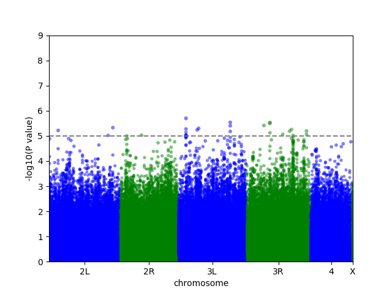
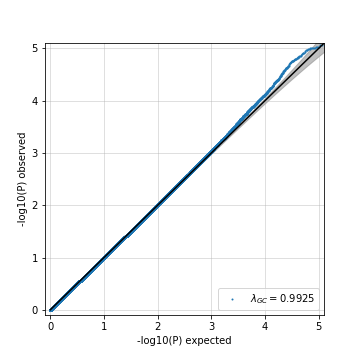

# Setup

## Loading packages, reproducibility

**Concerning reproducibility**: In order to guarantee reproducibility, keep the `.BuildReproducibleEnvironment(...)` FUNCTION active.

```{r loading packages and reproducibility, echo=FALSE, message=FALSE}

.LIST.OF.PACKAGES <- c(
  'data.table',           #
  'icesTAF',              # dos2unix function
  'lintr',                # good debugging tool
  'lme4',                 # 
  'reticulate',           # required to switch between R and python chunks, apparently
  'tictoc'                # 
)


source('Helper_Scripts/Environment_Manipulation_and_Reproducibility.R')

# In order to make the script 100% reproducible, keep the next line active:
.BuildReproducibleEnvironment(PROJECT.SNAPSHOT.DATE = "2018-05-15",
                              PROJECT.VERSION       = "3.4.3",
                              SCAN.FOR.PACKAGES     = FALSE)

.LoadPackages(.LIST.OF.PACKAGES)

```


## Checkpoint ans session info

```{r session info}
cat("The current checkpoint is:\n")
checkpoint::setSnapshot()
cat("\n\nSession Info:\n\n")
sessionInfo()
```


# Constants

```{r}

SEXUAL.DIMORPHISM            <- TRUE
PHENOTYPE.NAME               <- 'Food_Intake'
SEX                          <- 'Female'
NORMALITY.SIGNIFICANCE.LEVEL <- 0.05
INVERSIONS.CONSIDERED        <- c('In.2L.t', 'In.2R.NS', 'In.3R.P', 'In.3R.K', 'In.3R.Mo')

MAF.THRESHOLD=0.4


# GWAS Constants

NUMBER_OF_PERMUTATIONS       <-  0
OUTPUT_NAME                  <-  paste('../Outputs/GWAS', PHENOTYPE.NAME, sep='_')
PHENOTYPE_DATA               <-  paste('../Outputs/Fast-Lmm-Input-', PHENOTYPE.NAME, '-', SEX, '.txt', sep='')
VARIANTS_TO_TEST             <-  '../Outputs/Current_Pipeline_Variants'

fwrite(list(NUMBER_OF_PERMUTATIONS, OUTPUT_NAME, PHENOTYPE_DATA, VARIANTS_TO_TEST),
       file='Outputs/GWAS_Constants', sep="\n")
```


# Data and other Inputs

## Data

```{r}
# Main data

Phenotype_Raw <- read.delim('Inputs/Mass-Data-with-Line-IDs.txt', header=T, sep=" ")
# Phenotype_Raw <- read.delim('Data/Food-Intake-Garlapow.csv', header=F, sep=',')
# Phenotype_Raw <- read.delim('Data/Vonesch2016-IOD-Raw.txt', header=F)

# Supporting data

Dgrp2_Inversions <- read.csv('Data/inversion.csv', header=T)
Dgrp2_Infection <- read.csv('Data/wolbachia.csv')

# Some phenotypes actually use the flystock ID instead of the DGRP ID.
# For these cases, this data frame will come in handy.
# Dgrp_Flystock_Ids <- read.delim('Data/Dgrp-Flystocks-Ids.txt',
#                                 comment.char='#')
```


## Functions

Functions that were specifically programmed for this script

```{r functions}

source('Functions/NormalityHistogram.R')
source('Functions/ChisqForNormality.R')
source('Functions/WriteBare.R')
```


## Setting up Anaconda python
Making sure that Anaconda 2 python is used in case multiple python distributions are installed. FaST-LMM only works on Anaconda 2 python.

Path is set up depending on what OS is used

To-do: check if it also works for Mac
```{r}
if(.Platform$OS.type == "unix") {
  knitr::opts_chunk$set(engine.path = list(python = "/anaconda/bin/python"))
  use_python("/anaconda/bin/python")
} else {
  knitr::opts_chunk$set(engine.path = list(python = file.path(Sys.getenv("USERPROFILE"),"Anaconda2\\python.exe", fsep="\\")))
  use_python(file.path(Sys.getenv("USERPROFILE"),"Anaconda2\\python.exe", fsep="\\"))
}

knitr::knit_engines$set(
  engine.path = list(python = "C:/Users/micha/Anaconda2/python.exe")
)
```


## Phenotype adjustment procedure

```{r, echo=FALSE}
source("Scripts/Phenotype_Adjustment.R")
```


# Filtering Lines and Low Minor Allele Frequencies

At the moment, bash is causing some trouble in Windows R Markdown. Thus, in the meantime, I'm using a workaround to write a bash shell script using R code, and then executing it in an unix environment.

```{r}
cat(paste("#!/bin/bash

PHENOTYPE_NAME=", PHENOTYPE.NAME,"
MAF=", MAF.THRESHOLD,"

cd plink2_linux_x86_64
./plink2 --bfile ../Data/dgrp2 --keep ../Outputs/Plink-Lines-$PHENOTYPE_NAME.txt --maf $MAF --make-bed --out ../Outputs/Current_Pipeline_Variants
", sep=''),
file='Scripts/Plink2_Filtering_Alleles.sh')

# The following command is necessary to 
dos2unix('Scripts/Plink2_Filtering_Alleles.sh')
```

```{bash}
./Scripts/Plink2_Filtering_Alleles.sh
```


# FaST-LMM GWAS

```{python, engine.path="C:\\Users\\micha\\Anaconda2\\python.exe"}


# coding: utf-8

# # EXPLANATION
# This script performs GWAS on a pre-selected number of variants (in Plink binary format) and on a specific phenotype you want. Ideally, the phenotype has been adjusted for inversions, infection, and also log-transformed if the raw phenotype wasn't deemed normally distributed.
# 
# BEWARE: You should format your phenotype line IDs in the same way as denoted in the .fam variant file you are using.

#  # Time measurement
# 

# In[1]:


import time
start = time.clock()


# # CONSTANTS and INPUTS 

# In[2]:


import pandas as pd

data = pd.read_csv('Outputs/GWAS_Constants', header=None)

NUMBER_OF_PERMUTATIONS = int(data[0][0])
OUTPUT_NAME = data[0][1]
phenotype_data = data[0][2]
variants_to_test = data[0][3]


# # Importing, general preparations

# In[3]:


import os
os.chdir('FaST_LMM')

from fastlmm.association import single_snp
from fastlmm.inference.fastlmm_predictor import _snps_fixup, _pheno_fixup, _kernel_fixup, _SnpTrainTest
from random import shuffle
import numpy as np
import pandas as pd
import time
import os
# We're going to need PySnpTools, to do permutations, because we can shuffle bed files by varint using Bed
import sys
sys.path.append('../PySnpTools')
from pysnptools.snpreader import Bed
from shutil import copyfile


# # Actual GWAS

# In[4]:


# Clearing cache
# This ensures that the relationship matrix is recalculated for each phenotype.
try:
    os.remove('Outputs/Fast-Lmm-Cache/Gwas-Permutations-Cache.npz')
except OSError:
    pass


# Performing GWAS on the real phenotype:

time_0 = time.time()
results_df = single_snp(variants_to_test,  phenotype_data,
                        cache_file='Outputs/Fast-Lmm-Cache/Gwas-Permutations-Cache.npz',
                        leave_out_one_chrom=False,
                        save_test_statistic=True,
                        output_file_name = OUTPUT_NAME + '-Original.txt',
                        )
time_1 = time.time()

print('Time for full GWAS:' + str(time_1 - time_0) + 's')
print 'Total time: ' + str(time.clock()-start)


# In[ ]:


test_stat = pd.read_csv('../Outputs/Fast-Lmm-Cache/Test-Stat-Cache.txt', header=None)
test_stat = test_stat.replace('[\[\] ]', '', regex=True)
test_stat = pd.to_numeric(test_stat[0])

results_df['Full ID'] = results_df['Chr'].astype('str') + '_' + results_df['ChrPos'].astype('str')
results_df = pd.concat([results_df[['Chr', 'ChrPos', 'SNP', 'Full ID', 'PValue']], test_stat],
                       axis = 1)
results_df.columns = ['Chr', 'ChrPos', 'SNP', 'Full ID', 'PValue', 'F-test statistic']

mybed = Bed(variants_to_test + '.bed')
mysnpdata = mybed.read()

print 'Time: ' + str(time.clock()-start)


# In[ ]:


pheno = _pheno_fixup(phenotype_data, count_A1=None).read()
pheno = pheno.val[np.searchsorted(pheno.iid[:,1], mysnpdata.iid[:,1])]
snpdata = mysnpdata.val
diff = range(snpdata.shape[1])
maf = range(snpdata.shape[1])
n_alleles = range(snpdata.shape[1])
mean_major = range(snpdata.shape[1])
for i in range(snpdata.shape[1]):
    ref = [j for j, x in enumerate(snpdata[:,i]) if x == 2]
    alt = [j for j, x in enumerate(snpdata[:,i]) if x == 0]
    meanref = np.mean(pheno[ref])
    meanalt = np.mean(pheno[alt])
    if len(ref) > len(alt):
        diff[i] = meanref - meanalt
        maf[i] = float(len(alt)) / (len(ref) + len(alt))
        n_alleles[i] = len(ref) + len(alt)
        mean_major[i] = meanref
    elif len(ref) + len(alt) == 0:
        diff[i] = float('NaN')
        maf[i] = float('NaN')
        n_alleles[i] = len(ref) + len(alt)
        mean_major[i] = float('NaN')
    else:
        diff[i] = meanalt - meanref
        maf[i] = float(len(ref)) / (len(ref) + len(alt))
        n_alleles[i] = len(ref) + len(alt)
        mean_major[i] = meanalt
        
        
print 'Time: ' + str(time.clock()-start)


# In[ ]:


diff_df = diff_df = pd.DataFrame(data={'MajMinDiff':diff,
                                       'MeanMajor': mean_major,
                                       'MAF':maf,
                                       'NAlleles':n_alleles})
diff_df['SNP'] = mysnpdata.sid
results_df = pd.merge(results_df, diff_df, on='SNP')
    

# PHENOTYPE shuffling/permutation and adding the p-values from the resulting
# GWAS to the results data frame.
#phenotype_to_shuffle = pd.read_table(phenotype_data,
#                                     sep=' ', header=None)
#indices = range(len(phenotype_to_shuffle))
#temp_shuffled_pheno = '../Outputs/Fast-Lmm-Inputs/Temporary-Shuffled-Phenotype.txt'
#
#for i in range(NUMBER_OF_PERMUTATIONS):
#    time_permut_0 = time.time()
#    shuffle(indices)
#    phenotype_shuffled = []
#    for j in range(len(indices)):
#        phenotype_shuffled.append(phenotype_to_shuffle[2][indices[j]])
#    
#    phenotype_to_shuffle[2] = phenotype_shuffled
#    phenotype_to_shuffle.to_csv(temp_shuffled_pheno, header=False, index=False, sep=' ')
#    tmp_shuffled_df = single_snp(variants_to_test,  temp_shuffled_pheno,
##                                cache_file='../Outputs/Fast-Lmm-Cache/Gwas-Permutations-Cache'+str(i)
#                                 cache_file='../Outputs/Fast-Lmm-Cache/Gwas-Permutations-Cache.npz',
#                                 leave_out_one_chrom=False,
#                                 )
#    tmp_shuffled_df['Full ID'] = tmp_shuffled_df['Chr'].astype('str') + '_' + tmp_shuffled_df['ChrPos'].astype('str')
#    
#    # sorting the new df to match the original
#    tmp_shuffled_df = tmp_shuffled_df[['Full ID', 'PValue']]
#    tmp_shuffled_df['PValue'].rename('PValueShuffled'+str(i+1))
#    
#    
#    results_df = pd.merge(results_df, tmp_shuffled_df, on='Full ID')
#    print('Time for permutation GWAS:' + str(time.time() - time_permut_0) + 's')

print 'Time: ' + str(time.clock()-start)


# In[ ]:


# Shuffling ALLELES by VARIANT

for i in range(NUMBER_OF_PERMUTATIONS):
    time_permut_0 = time.time()
    
    # Python works a little different than R: Shuffle directly modifies the input data frame!
    np.random.shuffle(mysnpdata.val)
    Bed.write('VariantsPermuted', mysnpdata)
    copyfile(variants_to_test + '.bim', 'VariantsPermuted.bim')

    tmp_shuffled_df = single_snp('VariantsPermuted',  phenotype_data,
#                                cache_file='../Outputs/Fast-Lmm-Cache/Gwas-Permutations-Cache'+str(i)
                                 cache_file='../Outputs/Fast-Lmm-Cache/Gwas-Permutations-Cache.npz',
                                 leave_out_one_chrom=False,
                                 )
    tmp_shuffled_df['Full ID'] = tmp_shuffled_df['Chr'].astype('str') + '_' + tmp_shuffled_df['ChrPos'].astype('str')
    
    # sorting the new df to match the original
    tmp_shuffled_df = tmp_shuffled_df[['Full ID', 'SNP', 'PValue']]
    tmp_shuffled_df = tmp_shuffled_df.rename(columns={'Full ID':'Full IDShuffled'+str(i+1),
                                                      'PValue':'PValueShuffled'+str(i+1)})
    
    snpdata = mysnpdata.val
    diff = range(snpdata.shape[1])
    maf = range(snpdata.shape[1])
    n_alleles = range(snpdata.shape[1])
    mean_major = range(snpdata.shape[1])
    for k in range(snpdata.shape[1]):
        ref = [j for j, x in enumerate(snpdata[:,k]) if x == 2]
        alt = [j for j, x in enumerate(snpdata[:,k]) if x == 0]
        meanref = np.mean(pheno[ref])
        meanalt = np.mean(pheno[alt])
        if len(ref) > len(alt):
            diff[k] = meanref - meanalt
            maf[k] = float(len(alt)) / (len(ref) + len(alt))
            n_alleles[k] = len(ref) + len(alt)
            mean_major[k] = meanref
        elif len(ref) + len(alt) == 0:
            diff[k] = float('NaN')
            maf[k] = float('NaN')
            n_alleles[k] = len(ref) + len(alt)
            mean_major[k] = float('NaN')
        else:
            diff[k] = meanalt - meanref
            maf[k] = float(len(ref)) / (len(ref) + len(alt))
            n_alleles[k] = len(ref) + len(alt)
            mean_major[k] = meanalt
        
    diff_df = diff_df = pd.DataFrame(data={'MajMinDiffShuffled'+str(i+1):diff,
                                           'MeanMajorShuffled'+str(i+1): mean_major,
                                           'NAllelesShuffled'+str(i+1):n_alleles,
                                           'MAFShuffled'+str(i+1):maf})
    diff_df['SNP'] = mysnpdata.sid
    tmp_shuffled_df = pd.merge(tmp_shuffled_df, diff_df, on='SNP')
    tmp_shuffled_df = tmp_shuffled_df.rename(columns={'SNP':'SNPShuffled'+str(i+1)})
    
#    results_df = pd.merge(results_df, tmp_shuffled_df, on='Full ID')
    results_df = results_df.join(tmp_shuffled_df)
    print('Time for permutation GWAS:' + str(time.time() - time_permut_0) + 's')   
    

print 'Time: ' + str(time.clock()-start)


# In[ ]:


results_df.to_csv(OUTPUT_NAME + '-with-Permutations.txt', sep="\t", index=False)
print 'Time: ' + str(time.clock()-start)


# # Manhattan Plot

# In[ ]:


import pylab
import fastlmm.util.util as flutil
flutil.manhattan_plot(results_df.as_matrix(["Chr", "ChrPos", "PValue"]),pvalue_line=1e-5,xaxis_unit_bp=False, plot_threshold=1)
pylab.savefig('../Figures/GWAS_Manhattan_Plot.png')

print 'Time: ' + str(time.clock()-start)


# # QQ Plot

# In[ ]:


from fastlmm.util.stats import plotp
plotp.qqplot(results_df["PValue"].values, xlim=[0,5], ylim=[0,5])
pylab.savefig('../Figures/GWAS_QQPlot.png')

print 'Time: ' + str(time.clock()-start)
```

Output image:
  
  
  

```{r}
toc()
```

