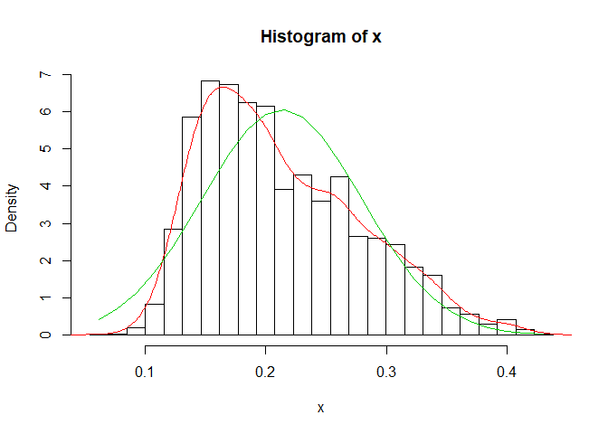
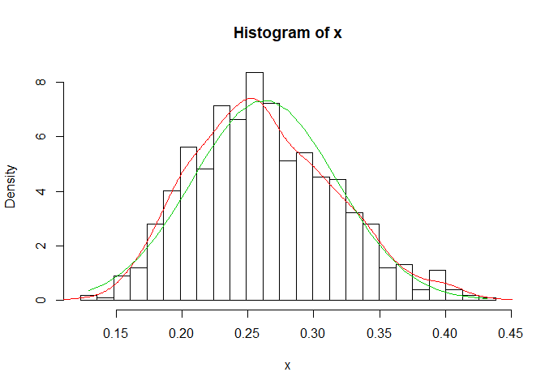
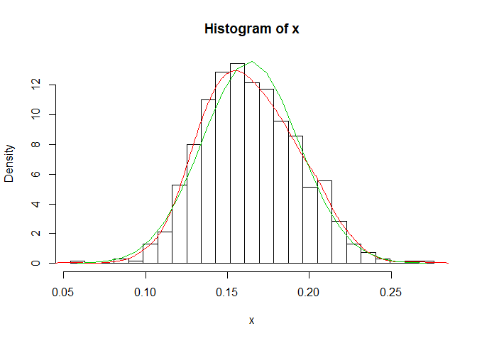
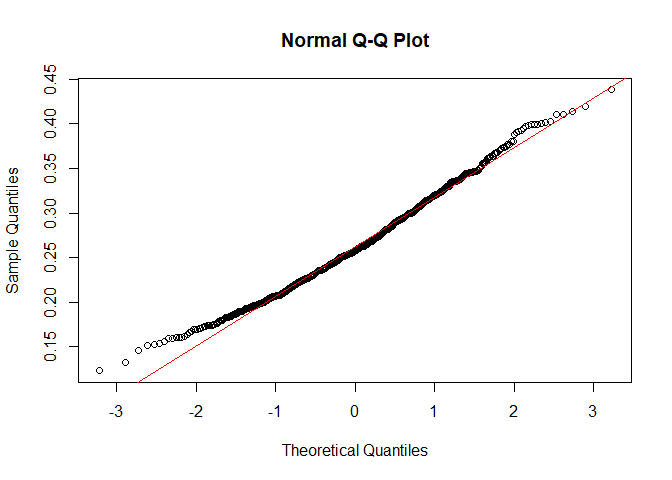
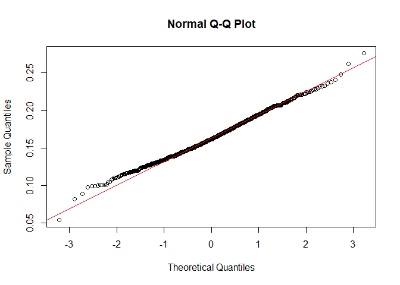
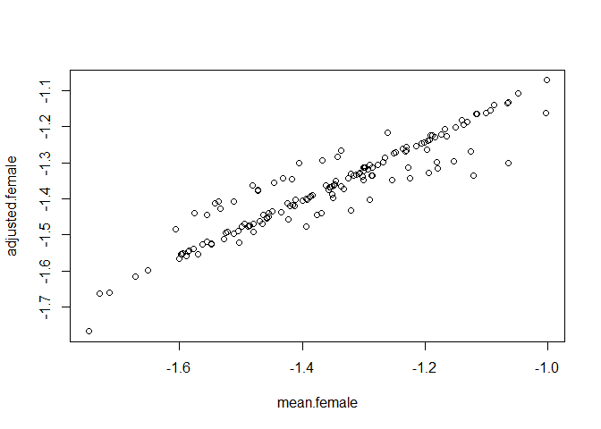
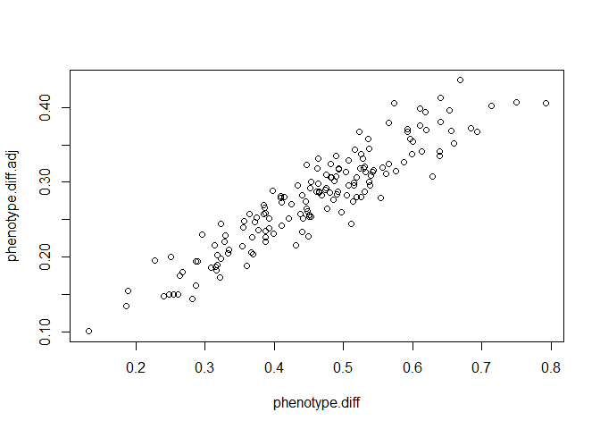

GWAS Pipeline Full
================
Michael Beyeler
2018-05-13

**Setup**
=========

Hi

Setup **TEst**
--------------

Hi

### Setup

Hi

#### Setup

Hi

##### Setup

Hi

Loading packages, Reproducibility
---------------------------------

**Concerning reproducibility**: In order to guarantee reproducibility, keep the `.BuildReproducibleEnvironment(...)` FUNCTION active.

``` r
if(!require('checkpoint', character.only=T))
  install.packages('checkpoint')

source('Helper_Scripts/Environment_Manipulation_and_Reproducibility.R')

# In order to make the script 100% reproducible, keep the next line active:
.BuildReproducibleEnvironment(PROJECT.SNAPSHOT.DATE = '2017-12-31',
                              PROJECT.VERSION       = '3.4.3',
                              SCAN.FOR.PACKAGES     = FALSE)

.LIST.OF.PACKAGES <- c(
  'data.table',           #
  'icesTAF',              # dos2unix function
  'lintr',                # good debugging tool
  'lme4',                 # 
  'tictoc'                # 
)
.LoadPackages(.LIST.OF.PACKAGES)
```

``` r
sessionInfo()
```

    ## R version 3.4.3 (2017-11-30)
    ## Platform: x86_64-w64-mingw32/x64 (64-bit)
    ## Running under: Windows 10 x64 (build 17134)
    ## 
    ## Matrix products: default
    ## 
    ## locale:
    ## [1] LC_COLLATE=English_United States.1252 
    ## [2] LC_CTYPE=English_United States.1252   
    ## [3] LC_MONETARY=English_United States.1252
    ## [4] LC_NUMERIC=C                          
    ## [5] LC_TIME=English_United States.1252    
    ## 
    ## attached base packages:
    ## [1] stats     graphics  grDevices utils     datasets  methods   base     
    ## 
    ## other attached packages:
    ## [1] tictoc_1.0           lme4_1.1-15          Matrix_1.2-12       
    ## [4] lintr_1.0.2          icesTAF_1.4-1        data.table_1.10.4-3 
    ## [7] checkpoint_0.4.3     RevoUtils_10.0.7     RevoUtilsMath_10.0.1
    ## 
    ## loaded via a namespace (and not attached):
    ##  [1] rex_1.1.2       Rcpp_0.12.14    knitr_1.18      magrittr_1.5   
    ##  [5] MASS_7.3-47     splines_3.4.3   lattice_0.20-35 R6_2.2.2       
    ##  [9] minqa_1.2.4     stringr_1.2.0   httr_1.3.1      tools_3.4.3    
    ## [13] grid_3.4.3      nlme_3.1-131    htmltools_0.3.6 yaml_2.1.16    
    ## [17] lazyeval_0.2.1  rprojroot_1.3-1 digest_0.6.13   nloptr_1.0.4   
    ## [21] evaluate_0.10.1 rmarkdown_1.6   stringi_1.1.6   compiler_3.4.3 
    ## [25] backports_1.1.2

Setting up Anaconda python
--------------------------

Path is set up depending on what OS is used

To-do: check if it also works for Mac

``` r
if(.Platform$OS.type == "unix") {
  knitr::opts_chunk$set(engine.path = list(python = '/anaconda/bin/python'))
} else {
  knitr::opts_chunk$set(engine.path = list(python = file.path(Sys.getenv("USERPROFILE"),"Anaconda2\\python.exe", fsep='\\')))
}
```

Functions
---------

Functions that were specifically programmed for this script

``` r
source('Functions/NormalityHistogram.R')
source('Functions/ChisqForNormality.R')
source('Functions/WriteBare.R')
```

Filtering Lines and Low Minor Allele Frequencies
================================================

At the moment, bash is causing some trouble in Windows R Markdown. Thus, in the meantime, I'm using a workaround to write a bash shell script using R code, and then executing it in an unix environment.

``` r
cat("#!/bin/bash

PHENOTYPE_NAME='Mass'
MAF=0.05

cd plink2_linux_x86_64
./plink2 --bfile ../Data/dgrp2 --keep ../Outputs/Plink-Lines-$PHENOTYPE_NAME.txt --maf $MAF --make-bed --out ../Outputs/MassVariants_MAF5
",
file='Scripts/Plink2_Filtering_Alleles.sh')

# The following command is necessary to 
dos2unix('Scripts/Plink2_Filtering_Alleles.sh')
```

``` bash
./Scripts/Plink2_Filtering_Alleles.sh
```

    ## PLINK v2.00a1LM 64-bit Intel (11 Feb 2018)     www.cog-genomics.org/plink/2.0/
    ## (C) 2005-2018 Shaun Purcell, Christopher Chang   GNU General Public License v3
    ## Logging to ../Outputs/MassVariants_MAF5.log.
    ## Options in effect:
    ##   --bfile ../Data/dgrp2
    ##   --keep ../Outputs/Plink-Lines-Mass.txt
    ##   --maf 0.05
    ##   --make-bed
    ##   --out ../Outputs/MassVariants_MAF5
    ## 
    ## Start time: Mon May 14 13:14:49 2018
    ## 16221 MB RAM detected; reserving 8110 MB for main workspace.
    ## Using up to 8 compute threads.
    ## 205 samples (205 females, 0 males; 205 founders) loaded from ../Data/dgrp2.fam.
    ## 4438427 variants loaded from ../Data/dgrp2.bim.
    ## Note: No phenotype data present.
    ## --keep: 157 samples remaining.
    ## 157 samples (157 females, 0 males; 157 founders) remaining after main filters.
    ## Calculating allele frequencies... 0%1%2%4%5%7%8%10%11%13%14%16%17%19%20%22%23%25%26%28%29%31%32%33%35%36%38%39%41%42%44%45%47%48%50%51%53%54%56%57%59%60%62%63%64%66%67%69%70%72%73%75%76%78%79%81%82%84%85%87%88%90%91%93%94%95%97%98%done.
    ## 2443905 variants removed due to minor allele threshold(s)
    ## (--maf/--max-maf/--mac/--max-mac).
    ## 1994522 variants remaining after main filters.
    ## Writing ../Outputs/MassVariants_MAF5.bed ... 0%1%3%4%6%7%9%10%12%13%15%16%18%19%21%22%24%25%26%28%30%31%33%34%36%37%38%40%42%43%45%46%48%49%51%52%54%55%57%59%60%61%63%64%65%66%67%69%70%72%73%75%76%78%79%80%82%83%85%86%88%89%91%92%94%95%97%98%done.
    ## Writing ../Outputs/MassVariants_MAF5.bim ... done.
    ## Writing ../Outputs/MassVariants_MAF5.fam ... done.
    ## End time: Mon May 14 13:14:50 2018

Phenotype Adjustment
====================

Constants
---------

``` r
SEXUAL.DIMORPHISM <- TRUE
PHENOTYPE.NAME <- 'Mass'
NORMALITY.SIGNIFICANCE.LEVEL <- 0.05
INVERSIONS.CONSIDERED <- c('In.2L.t', 'In.2R.NS', 'In.3R.P', 'In.3R.K', 'In.3R.Mo')
```

Data
----

``` r
# Main data

# Phenotype_Raw <- read.delim('Data/Food-Intake-Garlapow.txt', header=F)
# Phenotype_Raw <- read.delim('Data/Vonesch2016-IOD-Raw.txt', header=F)
Phenotype_Raw <- read.delim('Data/dgrp_mass.csv', header=T)

# Supporting data

Dgrp2_Inversions <- read.csv('Data/inversion.csv', header=T)
Dgrp2_Infection <- read.csv('Data/wolbachia.csv')

# Some phenotypes actually use the flystock ID instead of the DGRP ID.
# For these cases, this data frame will come in handy.
Dgrp_Flystock_Ids <- read.delim('Data/Dgrp-Flystocks-Ids.txt',
                                comment.char='#')
```

Adjustment procedure
--------------------

    ## [1] "Unique to Female:  "
    ## [1] "Unique to Male:  "



    ## [1] "p-value total 5.2630561996935e-21"
    ## [1] 1.025024e-05
    ## [1] 0.008176191
    ## [1] "At least one of the phenotypes was not normally distributed. Log-transformation performed."



FaST-LMM GWAS
=============

Coming soon...
